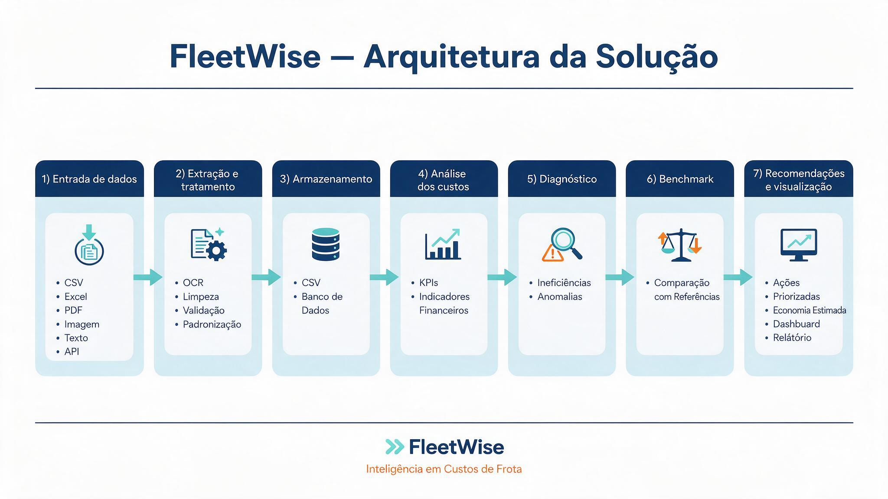

# 🚛 FleetWise

> Plataforma inteligente para consolidar custos de frota, identificar ineficiências e recomendar ações de redução de despesas.

O **FleetWise** é uma aplicação de inteligência de custos para gestão de frotas. A plataforma recebe dados operacionais em CSV ou Excel, organiza as despesas, calcula indicadores, identifica transações potencialmente anômalas, compara veículos por meio de benchmark interno e gera recomendações priorizadas para redução de custos.

---

## 🎯 Problema

Os custos de frota — como combustível, manutenção, pedágios, multas, impostos, seguros e outras despesas — frequentemente estão distribuídos entre sistemas, planilhas, extratos e documentos operacionais.

Essa fragmentação dificulta uma visão consolidada da operação e torna a análise manual mais lenta, sujeita a erros e pouco escalável.

O FleetWise busca responder a perguntas como:

- Qual é o custo total da frota no período analisado?
- Quais categorias possuem maior impacto financeiro?
- Quais veículos concentram os maiores custos?
- Existem despesas potencialmente fora do padrão?
- Quais veículos possuem custo por quilômetro acima da referência interna?
- Qual economia potencial pode ser obtida com ações de correção?

---

## 👥 Usuários

| Usuário | Necessidade atendida |
|---|---|
| **Gestor de Frota** | Compreender custos, comparar veículos e identificar ineficiências operacionais |
| **CFO / Liderança** | Visualizar impacto financeiro, riscos e oportunidades de economia |
| **Sem Parar Empresas** | Identificar clientes com oportunidades relevantes e relacionar soluções do portfólio |

---

## 📋 User Stories selecionadas

| ID | User Story | Como o FleetWise responde |
|---|---|---|
| US01 | Consolidar custos | Importa arquivos CSV e XLSX e organiza dados em categorias padronizadas |
| US02 | Identificar ineficiências | Calcula indicadores, rankings e destaca transações potencialmente anômalas |
| US03 | Estimar economia | Compara custo por quilômetro dos veículos com o benchmark interno da frota |
| US04 | Receber recomendações | Gera plano de ação priorizado com economia potencial estimada |
| US05 | Trabalhar com dados incompletos | Valida colunas, valores e categorias antes da análise |
| US06 | Acompanhar evolução | Previsto como evolução futura, com persistência e comparação histórica |

---

## 💡 Solução implementada

O FleetWise recebe registros de despesas operacionais da frota e executa um fluxo de análise composto por:

1. Upload de arquivos CSV ou Excel (`.xlsx`)
2. Padronização das colunas recebidas
3. Validação de estrutura e qualidade dos dados
4. Filtros por veículo, categoria e período
5. Cálculo de indicadores financeiros
6. Análise de custos por categoria e por veículo
7. Detecção de transações potencialmente anômalas
8. Cálculo de custo por quilômetro
9. Comparação com benchmark interno da frota
10. Geração de recomendações e economia potencial estimada
11. Exportação de dados, plano de ação e relatório executivo

---

## ✨ Funcionalidades

### Importação e validação

- Upload de arquivos `.csv`
- Upload de arquivos `.xlsx`
- Padronização de dados recebidos
- Validação de colunas obrigatórias
- Validação de categorias permitidas
- Tratamento de erros de leitura
- Mensagens claras para arquivos inválidos ou incompletos

### Filtros interativos

- Filtro por veículo
- Filtro por categoria
- Filtro por período
- Atualização da análise conforme os filtros selecionados

### Indicadores e análises

- Custo total da frota
- Quantidade de veículos
- Quantidade de transações
- Custo médio por veículo
- Custos por categoria
- Participação percentual de cada categoria
- Custos por veículo
- Ranking de veículos mais custosos

### Diagnósticos e benchmark

- Diagnóstico por veículo
- Diagnóstico por categoria
- Identificação de transações potencialmente anômalas
- Cálculo de custo por quilômetro
- Benchmark interno da frota
- Estimativa de economia potencial para veículos acima da referência

### Recomendações e exportações

- Plano de ação priorizado
- Estimativa de economia potencial
- Exportação de dados filtrados em CSV
- Exportação do plano de ação em CSV
- Exportação de relatório executivo em Excel

O relatório executivo em Excel inclui:

- Resumo executivo
- Custos por categoria
- Veículos críticos
- Anomalias identificadas
- Plano de ação priorizado

---

## 🗂️ Dados utilizados

A aplicação processa dados relacionados a:

- Cadastro de veículos
- Abastecimentos
- Manutenções
- Pedágios
- Multas
- Impostos
- Seguros
- Outras despesas operacionais

### Formato esperado

O arquivo importado deve conter as seguintes colunas:

| Coluna | Descrição | Exemplo |
|---|---|---|
| `data` | Data da despesa | `2026-08-01` |
| `veiculo_id` | Identificador do veículo | `V001` |
| `categoria` | Categoria da despesa | `Combustível` |
| `descricao` | Descrição da transação | `Diesel` |
| `quantidade` | Quantidade relacionada à despesa | `180` |
| `valor_total` | Valor total da transação | `1080.00` |
| `quilometragem` | Quilometragem registrada | `45200` |

### Categorias aceitas

```text
Combustível
Manutenção
Pedágio
Multa
Impostos
Seguro
Outros
```

### Exemplo de arquivo CSV

```csv
data,veiculo_id,categoria,descricao,quantidade,valor_total,quilometragem
2026-08-01,V001,Combustível,Diesel,180,1080.00,45200
2026-08-03,V001,Pedágio,Rodovia Anhanguera,1,18.50,45410
2026-08-10,V002,Manutenção,Troca de pneus,4,3200.00,38900
```

---

## 🏗️ Arquitetura



```text
Arquivo CSV/XLSX
        ↓
Leitura e padronização
        ↓
Validação de dados
        ↓
Filtros interativos
        ↓
KPIs e análise de custos
        ↓
Diagnósticos e anomalias
        ↓
Benchmark interno
        ↓
Recomendações e economia potencial
        ↓
Exportação CSV e relatório executivo em Excel
```

---

## 🖥️ Dashboard

O FleetWise possui um dashboard desenvolvido com Streamlit para visualização dos custos, diagnósticos, benchmarks, recomendações e exportações.

O dashboard disponibiliza as seguintes áreas:

| Área | Descrição |
|---|---|
| Custos | Custos por categoria e participação no total |
| Veículos | Ranking de custos por veículo |
| Diagnóstico | Diagnóstico de veículos, categorias e anomalias |
| Benchmarks | Custo por quilômetro e economia potencial |
| Recomendações | Plano de ação e economia estimada |
| Exportações | Download de dados filtrados e relatório executivo |

---

## 🛠️ Tecnologias utilizadas

| Tecnologia | Uso no projeto |
|---|---|
| Python | Linguagem principal |
| Streamlit | Dashboard web interativo |
| Pandas | Leitura, tratamento e análise de dados |
| OpenPyXL | Leitura e geração de arquivos Excel |
| Pytest | Testes automatizados |
| Git e GitHub | Versionamento do projeto |

---

## 📁 Estrutura do projeto

```text
FleetWise/
├── data/
│   ├── frota_simulada.csv
│   └── frota_simulada.xlsx
│
├── diagrams/
│   └── arquitetura-geral.png
│
├── src/
│   ├── __init__.py
│   ├── benchmarks.py
│   ├── dashboard.py
│   ├── data_loader.py
│   ├── diagnostics.py
│   ├── metrics.py
│   ├── recommendations.py
│   ├── reports.py
│   └── validators.py
│
├── tests/
│   └── test_reports.py
│
├── .gitignore
├── README.md
└── requirements.txt
```

> A pasta `.venv/` não deve ser enviada para o repositório. Ela está incluída no `.gitignore`.

---

## 🚀 Como executar

### Pré-requisitos

- Python 3.10 ou superior
- Pip
- Git

### 1. Clone o repositório

```bash
git clone <URL_DO_REPOSITORIO>
cd FleetWise
```

### 2. Crie o ambiente virtual

No Windows:

```powershell
python -m venv .venv
```

### 3. Ative o ambiente virtual

```powershell
.\.venv\Scripts\Activate.ps1
```

Caso o PowerShell bloqueie scripts:

```powershell
Set-ExecutionPolicy -Scope Process -ExecutionPolicy Bypass
.\.venv\Scripts\Activate.ps1
```

### 4. Instale as dependências

```powershell
pip install -r requirements.txt
```

### 5. Execute a aplicação

```powershell
python -m streamlit run src/dashboard.py
```

Após a execução, acesse:

```text
http://localhost:8501
```

Na barra lateral, envie o arquivo:

```text
data/frota_simulada.csv
```

ou:

```text
data/frota_simulada.xlsx
```

---

## 🧪 Testes

Para executar todos os testes automatizados:

```powershell
python -m pytest
```

Para executar somente os testes do relatório:

```powershell
python -m pytest tests/test_reports.py
```

---

## ⚠️ Limitações atuais

- Os dados de demonstração são simulados.
- O benchmark é interno e calculado somente com base nos dados carregados.
- A economia potencial representa uma estimativa, não uma garantia financeira.
- A validação de anomalias deve ser revisada por um responsável operacional.
- O MVP aceita CSV e XLSX.
- Importação de PDF, imagem e OCR ainda não foi implementada.
- Não há banco de dados nem histórico persistente entre execuções.

---

## 🔮 Evoluções futuras

- Upload e leitura de PDFs
- OCR para notas fiscais, extratos e imagens
- Persistência em banco de dados
- Histórico de custos e comparações mensais
- Alertas automáticos para despesas fora do padrão
- Integração com plataformas de abastecimento, pedágio e manutenção
- Benchmark externo por tipo de veículo ou segmento
- Autenticação de usuários
- Exportação do relatório executivo em PDF
- Deploy em cloud

---

## 🎥 Vídeo demonstrativo

**Link do vídeo:**

```text
https://youtu.be/8vaDVYo_XfM?si=dXBNiaqcyPlNY3Z5
```

---

## 📄 Observações

Este projeto possui finalidade acadêmica. Os resultados dependem da qualidade e consistência dos dados enviados. Os indicadores, anomalias, recomendações e estimativas de economia devem ser utilizados como apoio à decisão e validados antes da adoção de ações operacionais ou financeiras.
